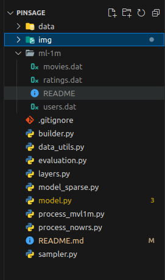

Clone from https://github.com/dmlc/dgl/tree/master/examples/pytorch/pinsage

# Data format MovieLens-1m
gồm 3 file chính movies.dat, ratings.dat, users.dat được mô tả và cấu trúc như sau:
Để dễ dàng chạy khuyến khích đổi tên file y hệt để không phải chỉnh tên file vì code đang fix cứng file path

## movies.dat: `id`, `name`, `category` x n (split by `::`)

- Titles are identical to titles provided by the IMDB (including
year of release)
- Genres are pipe-separated and are selected from the following genres:

	* Action
	* Adventure
	* Animation
	* Children's
	* Comedy
	* Crime
	* Documentary
	* Drama
	* Fantasy
	* Film-Noir
	* Horror
	* Musical
	* Mystery
	* Romance
	* Sci-Fi
	* Thriller
	* War
	* Western

	(có thể nhiều category hơn nhưng vẫn phải tuân theo format data như miêu tả ở trên
	ví dụ: bộ phim ToyStory -> trong data sẽ là 432::ToyStory::Comedy|Child|Family) định dạng file `.dat`

## users.dat: `id`, `gender`, `age`, `occupation`, `timestamp` (split by `::`)

- Gender is denoted by a "M" for male and "F" for female
- Age is chosen from the following ranges:

	*  1:  "Under 18"
	* 18:  "18-24"
	* 25:  "25-34"
	* 35:  "35-44"
	* 45:  "45-49"
	* 50:  "50-55"
	* 56:  "56+"

- Occupation is chosen from the following choices:

	*  0:  "other" or not specified
	*  1:  "academic/educator"
	*  2:  "artist"
	*  3:  "clerical/admin"
	*  4:  "college/grad student"
	*  5:  "customer service"
	*  6:  "doctor/health care"
	*  7:  "executive/managerial"
	*  8:  "farmer"
	*  9:  "homemaker"
	* 10:  "K-12 student"
	* 11:  "lawyer"
	* 12:  "programmer"
	* 13:  "retired"
	* 14:  "sales/marketing"
	* 15:  "scientist"
	* 16:  "self-employed"
	* 17:  "technician/engineer"
	* 18:  "tradesman/craftsman"
	* 19:  "unemployed"
	* 20:  "writer"

	Ví dụ: 5::M::25::20::55455

## ratings.dat: `user_id`, `movie_id`, `rating`, `zipcode` (split by `::`)

	Ví dụ: 1::914::3::978301968

Lưu ý có thể đổi tên folder chứa 3 file này thành `ml-1m` để đỡ phải config quá nhiều

# notebook mẫu

	https://colab.research.google.com/drive/1-78ittr0B52GPLHm_rIrIaye9bnkhGVj#scrollTo=cvJ0OUChGszt